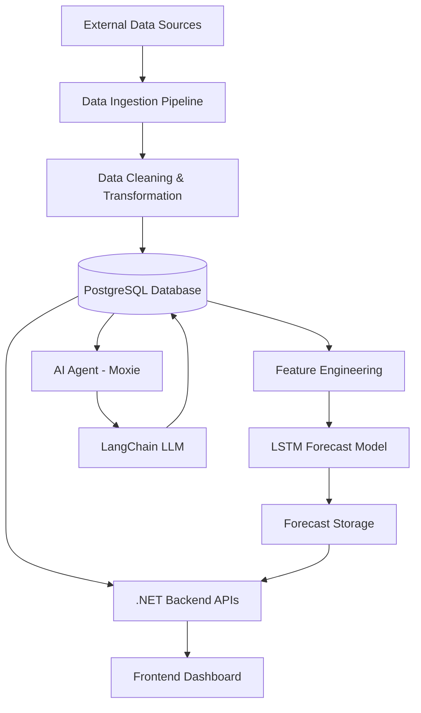
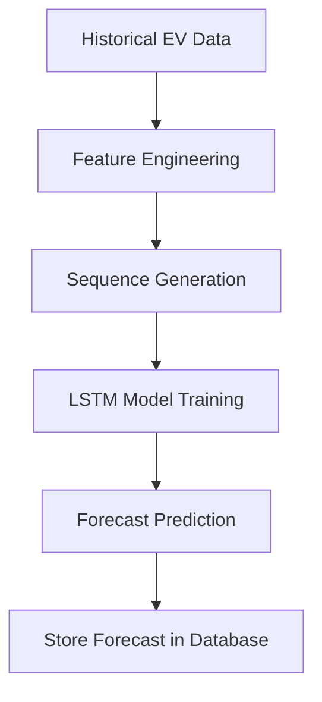
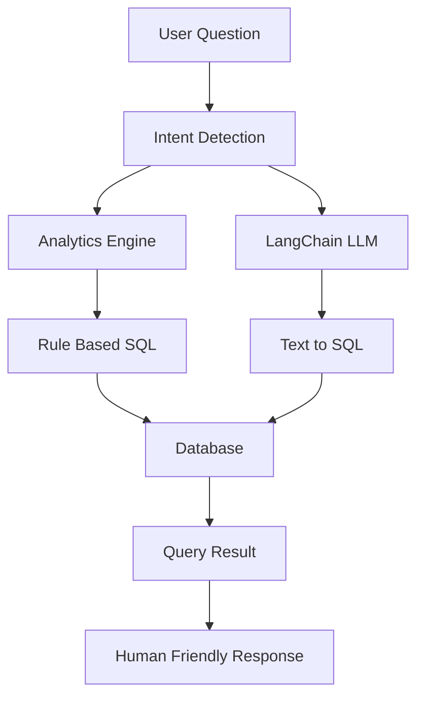
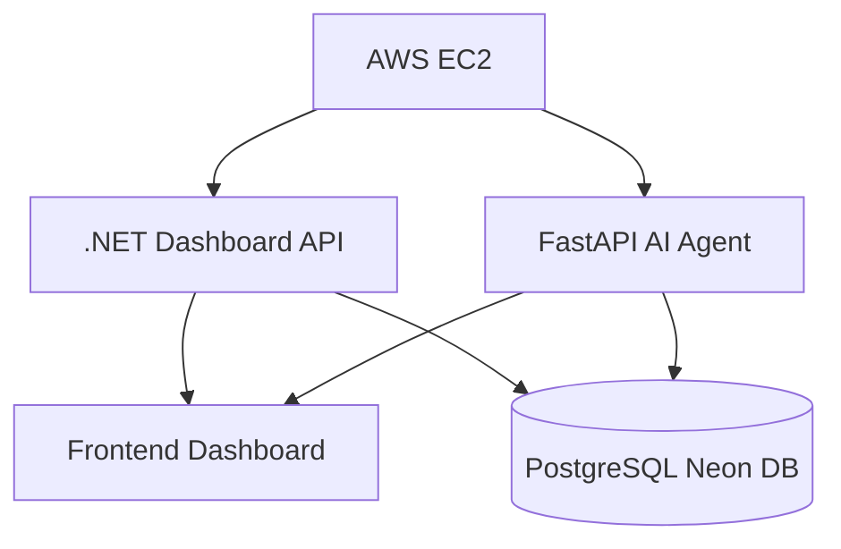

# ⚡ EV Intelligence Platform

### AI-Powered Electric Vehicle Analytics, Forecasting & Conversational Intelligence

The **EV Intelligence Platform** is an end-to-end **AI and data engineering system** that analyzes electric vehicle adoption trends, charging infrastructure growth, and future EV demand using **deep learning forecasting and conversational AI**.

The platform integrates **data pipelines, machine learning, full-stack web development, and AI agents** to deliver interactive EV insights through a modern analytics dashboard and an AI assistant.

The entire system is deployed on **AWS EC2 Free Tier** with optimized memory usage and automated pipelines.

---

# 🌐 Live Platform

### Dashboard

```
http://18.207.118.178:5212
```

### AI Assistant (Moxie API)

```
http://18.207.118.178:8001/docs
```

---

# 🚀 Platform Capabilities

The EV Intelligence Platform provides:

✔ EV adoption analytics
✔ Charging infrastructure intelligence
✔ Deep learning EV forecasting
✔ Interactive dashboard visualizations
✔ Conversational AI analytics assistant
✔ Automated data pipelines

The system combines **Data Engineering + Machine Learning + Full Stack Development + AI Agents** in one unified platform.

---

# 🧠 System Architecture



---

# 📁 Project Structure

```
EV_Analysis
│
├── ai_agent
│   ├── agent.py
│   ├── analytics_engine.py
│   ├── assistant_helper.py
│   ├── requirements.txt
│
├── data_ingestion
│   ├── gov_registrations_loader.py
│   ├── kaggle_registration_loader.py
│   ├── manufacturer_sales_loader.py
│   ├── manufacturer_location_loader.py
│   ├── opencharge_api.py
│   └── category_mapper.py
│
├── ml_pipeline
│   ├── feature_engineering.py
│   ├── train_lstm.py
│   ├── predict_lstm.py
│   └── save_forecast_to_db.py
│
├── database
│   ├── db_connection.py
│   └── schema.py
│
├── EVIntelligence.API
│   ├── Controllers
│   ├── Services
│   ├── Models
│   ├── frontend
│   │   ├── css
│   │   ├── js
│   │   ├── index.html
│   │   ├── market.html
│   │   ├── technical.html
│   │   └── ai.html
│   └── Program.cs
│
├── pipeline_runner.py
└── requirements.txt
```

---

# 🔄 Data Engineering Pipeline

The platform collects EV ecosystem data from **multiple sources**.

### Data Sources

• Government EV registration datasets
• Kaggle EV datasets
• OpenChargeMap API (charging infrastructure)
• Manufacturer EV sales datasets
• EV specifications datasets

---

### Data Pipeline Flow


The pipeline processes:

* EV registrations by state
* charging infrastructure data
* manufacturer sales
* vehicle specifications

This structured data is stored in a **PostgreSQL database (Neon DB)**.

---

# 🧮 Feature Engineering

Feature engineering prepares the dataset for machine learning forecasting.

Key transformations include:

• time-series aggregation
• monthly EV adoption growth metrics
• infrastructure density indicators
• state-level EV adoption metrics
• historical sequence generation for LSTM models

These engineered features help the model detect **long-term EV adoption trends**.

---

# 🤖 Deep Learning Forecast Model

The platform uses **LSTM (Long Short-Term Memory)** neural networks to forecast EV registrations.

### Framework

```
TensorFlow / Keras
```

---

### Why LSTM?

EV adoption is a **time-series problem** where historical patterns influence future growth.

LSTM models capture:

• long-term dependencies
• seasonal patterns
• nonlinear growth trends

---

### Model Pipeline



---

### Model Evaluation

The dashboard displays model performance metrics:

• RMSE (Root Mean Squared Error)
• MAE (Mean Absolute Error)

---

# 💻 Full Stack Development

The platform uses a **hybrid full stack architecture combining .NET and Python**.

### Backend Technologies

| Technology            | Role             |
| --------------------- | ---------------- |
| ASP.NET Core (.NET 8) | Dashboard APIs   |
| FastAPI (Python)      | AI agent backend |
| SQLAlchemy            | database access  |
| PostgreSQL            | data storage     |

---

### Backend Responsibilities

The **.NET backend** handles:

• dashboard APIs
• KPI endpoints
• analytics queries
• infrastructure analytics

The **Python backend** powers:

• AI agent (Moxie)
• natural language analytics queries
• Text-to-SQL generation
• advanced data analysis

---

# 🎨 Frontend Development

The frontend dashboard is built using:

• HTML
• CSS
• JavaScript
• Chart.js

Features include:

✔ modern analytics UI
✔ interactive charts
✔ dynamic KPI panels
✔ AI chatbot interface

---

# 🤖 AI Assistant — Moxie

**Moxie** is an AI assistant that allows users to explore EV insights using natural language.

Example queries:

```
Top states with highest EV registrations
EV growth from 2020 to 2024
Charging stations by state
Market share of EV manufacturers
```

---

# 🧠 AI Agent Architecture



---

# ⚙️ Hybrid Query System

To improve reliability, the AI assistant uses **two query layers**.

### Rule-Based Analytics Engine

Handles advanced analytical queries such as:

• CAGR calculations
• EV growth analysis
• infrastructure statistics
• market share metrics

---

### LLM Text-to-SQL Agent

Uses **LangChain + Groq LLM** to dynamically convert natural language into SQL queries.

---

### Guardrails & Optimization

The AI system includes:

• SQL validation
• query sanitization
• table restrictions
• optimized query execution

---

# ☁️ Cloud Deployment

The entire platform is deployed on **AWS EC2 Free Tier**.



---

# ⚡ Memory Optimization

AWS Free Tier provides only **~1GB RAM**, so swap memory was configured.

```
Swap Memory: 3GB
```

This allows the server to run:

• .NET backend
• FastAPI AI agent
• ML pipelines

simultaneously.

---

# 🔄 Automated ML Pipeline

The ML pipeline runs automatically through **GitHub Actions + Docker**.

Pipeline steps:

```
1 Data ingestion
2 Feature engineering
3 LSTM model training
4 Forecast generation
5 Save predictions to database
```

This ensures the dashboard always displays **updated forecasts**.

---

### Overview Dashboard


---

### EV Analytics


---

### Infrastructure Analytics


---

### AI Assistant (Moxie)


---

# 🚀 Key Features

✔ Automated EV data pipeline
✔ Deep learning EV forecasting
✔ Interactive analytics dashboards
✔ Conversational AI assistant
✔ Hybrid Text-to-SQL system
✔ Cloud deployment on AWS

---

# 🛠 Technology Stack

### Data Engineering

Python, Pandas, SQLAlchemy

### Machine Learning

TensorFlow, Keras, LSTM

### Backend

ASP.NET Core (.NET 8), FastAPI

### AI / LLM

LangChain, Groq API

### Frontend

HTML, CSS, JavaScript, Chart.js

### Database

PostgreSQL (Neon)

### Cloud

AWS EC2, Docker, GitHub Actions

---

# 👨‍💻 Author

**Subham Das**

AI / Data Engineer

Passionate about building **AI-powered data platforms, intelligent analytics systems, and scalable data pipelines.**

